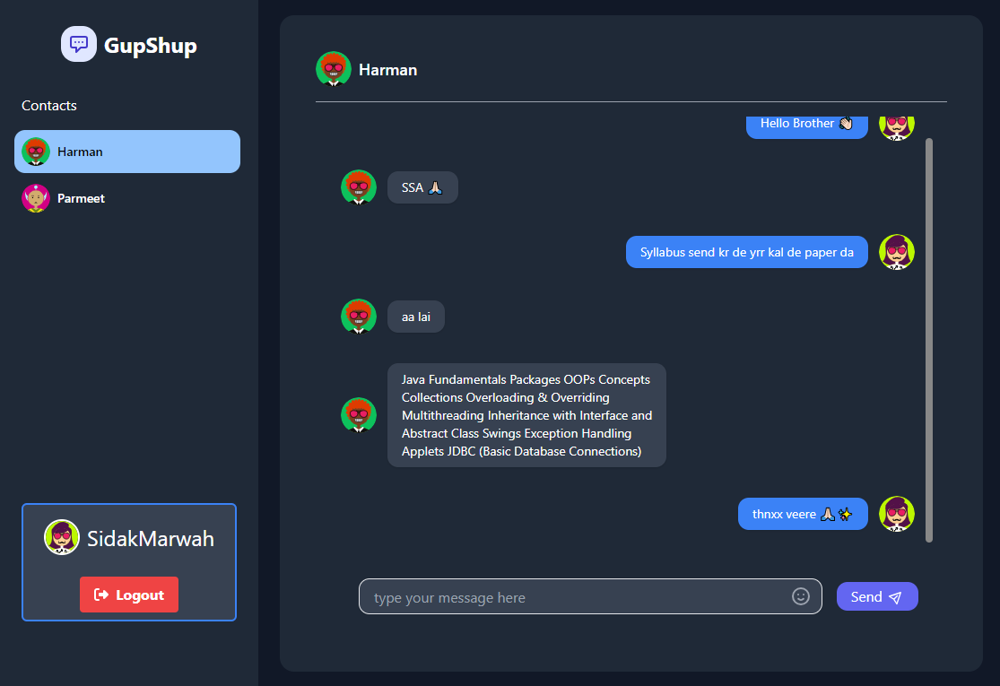
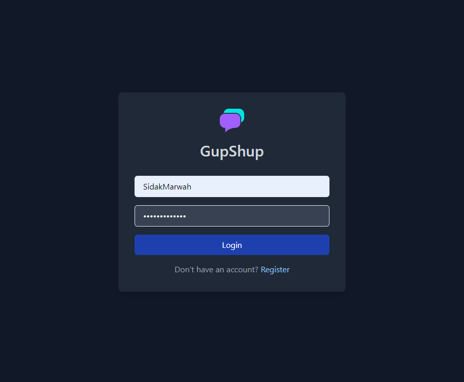
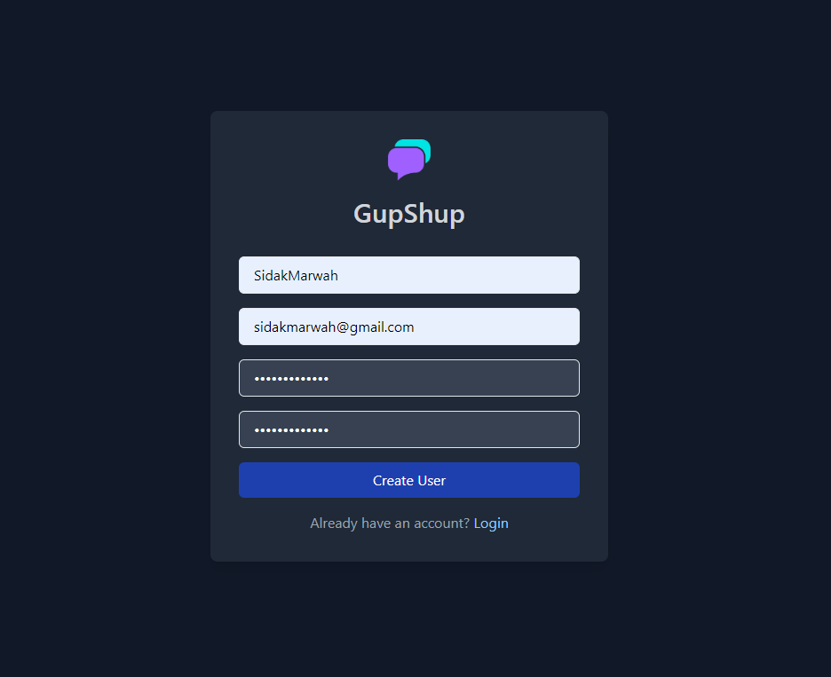
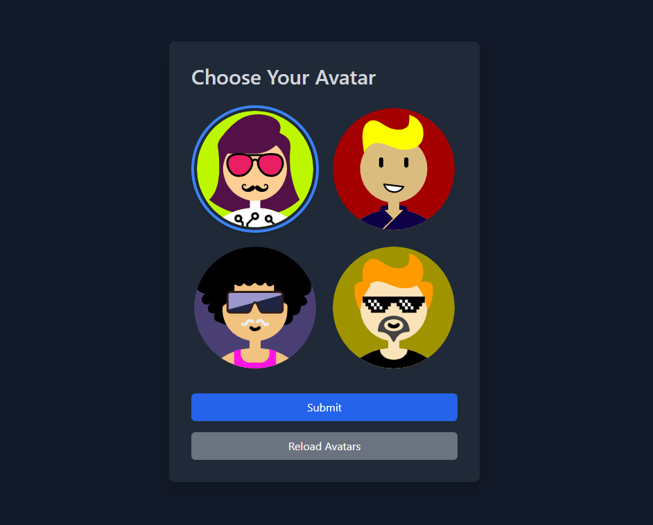

# MERN Chat Application with Socket.IO

This is a real-time chat application built using the MERN (MongoDB, Express.js, React.js, Node.js) stack along with Socket.IO for real-time communication.



## Features

- User authentication: Users can sign up or log in to the application.
- Set avatar: Users can set their avatars after signing up.
- Real-time messaging: Users can send and receive messages in real-time.

## Screenshots

### Login/Signup Page



### Set Avatar Page


### Chat Interface


## Installation

1. Clone the repository:
   ```
   git clone https://github.com/SidakMarwah/GupShup.git
   ```
2. Install dependencies for the frontend:
   ```
   cd GupShup/public
   npm install
   ```
3. Install dependencies for the backend:
   ```
   cd ../server
   npm install
   ```
4. Create a `.env` file inside the `server` directory with the following contents:
   ```
   PORT=5000
   MONGO_URL="mongodb://localhost:27017/GupShup"
   ORIGIN="http://localhost:5173"
   ```
5. Start the Vite application (frontend):
   ```
   cd ../public
   npm run dev
   ```
6. Start the backend server:
   ```
   cd ../server
   npm start
   ```
7. Access the application at `http://localhost:5173`.

## Technologies Used

- MongoDB: Database for storing user information and messages.
- Express.js: Backend framework for handling HTTP requests.
- React.js: Frontend library for building the user interface.
- Node.js: JavaScript runtime for server-side logic.
- Socket.IO: Library for real-time, bidirectional communication between clients and servers.
- Vite: Frontend build tool for the lightning-fast development experience.

## License

This project is for personal or non-commercial use only. All rights reserved.

## Follow Me

Connect with me on:

- [LinkedIn](https://www.linkedin.com/in/sidakmarwah/)
- [Twitter](https://twitter.com/sidakmarwah)
- Email: sidakmarwah@gmail.com

---